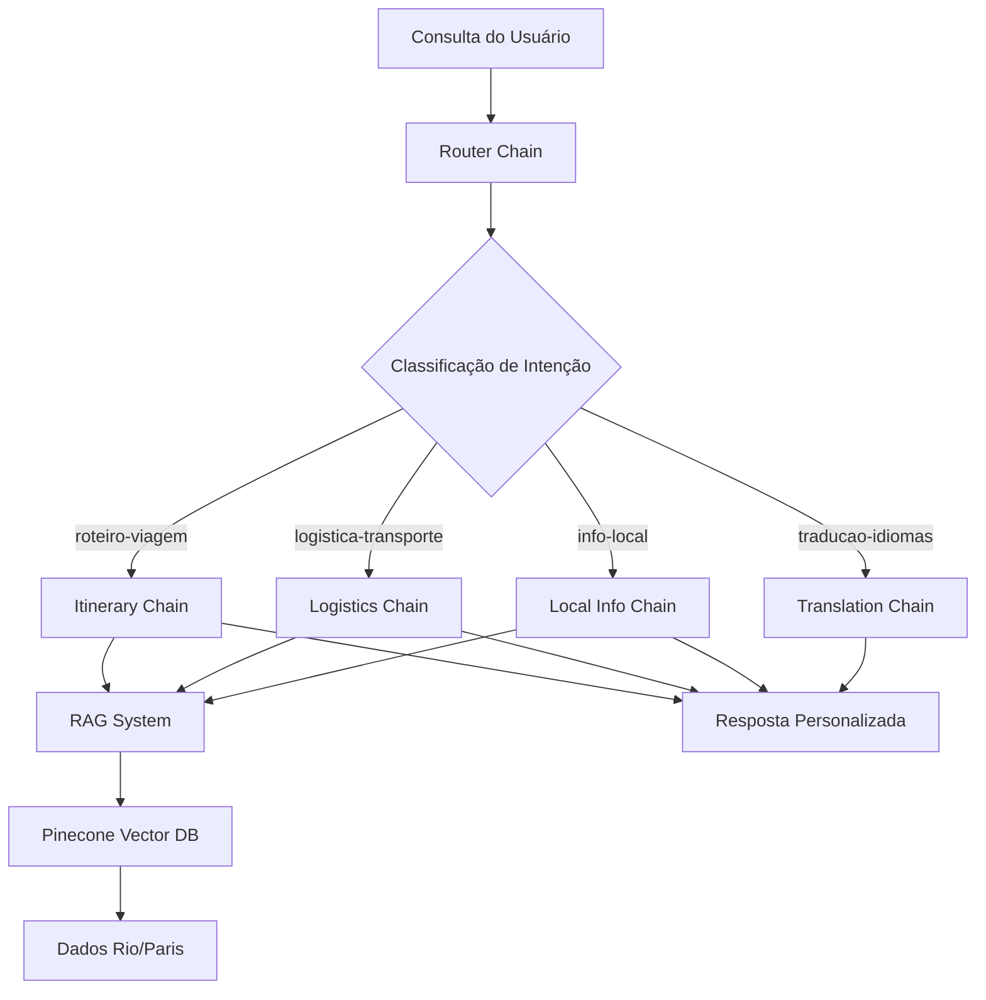

# 🌍 Guia de Viagem Inteligente com IA

Sistema avançado de assistente de viagem que utiliza **Router Chains** e **RAG** para classificar intenções e fornecer respostas personalizadas através de cadeias especializadas.

## 🎯 Objetivo do Projeto

Demonstrar o poder das **Router Chains** do LangChain para criar um sistema que:
- 🔍 **Classifica automaticamente** a intenção de consultas turísticas
- 🎯 **Roteia para cadeias especializadas** baseado na intenção detectada
- 🗺️ **Gera roteiros personalizados** com base no perfil do turista
- ⚡ **Responde rapidamente** usando Groq como motor de inferência
- 📚 **Acessa informações atualizadas** via RAG com Pinecone

## 🛠️ Tecnologias

- **🔗 LangChain**: Framework para orquestração das cadeias e roteamento
- **⚡ Groq**: Motor de inferência ultra-rápido para LLM (llama3-8b-8192)
- **📊 Pinecone**: Base de dados vetorial serverless para RAG
- **🧠 RAG**: Retrieval-Augmented Generation para informações específicas
- **🔤 Sentence Transformers**: Embeddings semânticos (all-MiniLM-L6-v2)

## 🏗️ Arquitetura do Sistema



## 📂 Estrutura do Projeto

```
guia_viagem/
├── 📁 src/
│   ├── 🔧 config.py           # Configurações centrais
│   ├── 🧭 router.py           # Router Chain principal  
│   ├── 🔍 rag.py              # Sistema RAG + Pinecone
│   ├── 🚀 main.py             # Orquestrador principal
│   ├── 📁 chains/             # Cadeias especializadas
│   │   ├── 🗺️ itinerary_chain.py      # Roteiros
│   │   ├── 🚗 logistics_chain.py       # Transporte
│   │   ├── 📍 local_info_chain.py      # Info locais
│   │   └── 🗣️ translation_chain.py     # Tradução
│   └── 📁 data/               # Base de conhecimento
│       ├── 🇧🇷 rio_janeiro.json       # 9+ pontos RJ
│       └── 🇫🇷 paris.json             # 10+ pontos Paris
├── 📁 examples/               # Demos e testes
├── ⚙️ setup.py               # Configuração automática
├── 📋 requirements.txt       # Dependências Python
└── 📖 INSTALACAO.md          # Guia completo
```

## 🚀 Uso Rápido

### 💬 Interface Interativa (Recomendado)
```bash
python run.py
```
*Interface de chat em tempo real - a melhor forma de testar o sistema!*

📖 **[Guia Detalhado de Instalação](INSTALACAO.md)**

## 🎯 Como Funciona

### 1. 🔍 Classificação de Intenções (Router Chain)

O sistema analisa a consulta e classifica em uma das **4 categorias**:

| Intenção | Descrição | Exemplo |
|----------|-----------|---------|
| `roteiro-viagem` | Roteiros personalizados | *"Roteiro cultural Paris 3 dias"* |
| `logistica-transporte` | Transporte/acomodação | *"Como chegar ao Cristo Redentor?"* |
| `info-local` | Detalhes específicos | *"Horário Louvre"* |
| `traducao-idiomas` | Guias de tradução | *"Frases francês turistas"* |

### 2. 🎯 Roteamento para Chain Especializada

Cada intenção é processada por uma **chain dedicada**:

- **🗺️ Itinerary Chain**: Usa RAG para buscar atrações + gera roteiro detalhado
- **🚗 Logistics Chain**: Consulta base de transporte + fornece direções  
- **📍 Local Info Chain**: Busca informações específicas + detalhes práticos
- **🗣️ Translation Chain**: Gera guias de idioma contextualmente relevantes

### 3. 📊 Sistema RAG Integrado

- **Base vetorial**: 19 locais indexados (Rio + Paris)
- **Busca semântica**: Sentence Transformers para embeddings
- **Recuperação inteligente**: Top-K resultados mais similares
- **Contextualização**: LLM gera resposta baseada nos dados recuperados

## 🏙️ Base de Conhecimento

### 🇧🇷 Rio de Janeiro (9 locais)
- **Pontos turísticos**: Cristo Redentor, Pão de Açúcar, Copacabana, Ipanema
- **Cultura**: Santa Teresa, Maracanã
- **Gastronomia**: Aprazível, Confeitaria Colombo  
- **Transporte**: Sistema Metrô Rio

### 🇫🇷 Paris (10 locais)
- **Monumentos**: Torre Eiffel, Louvre, Notre-Dame, Champs-Élysées
- **Cultura**: Montmartre
- **Gastronomia**: Le Comptoir, Breizh Café, Du Pain et des Idées
- **Transporte**: Metrô, Vélib'

## 💡 Exemplos de Uso

### 🗺️ Roteiros Personalizados
```
👤 "Quero roteiro cultural em Paris por 3 dias"

🤖 Gera roteiro dia-a-dia com:
   • Locais culturais próximos geograficamente  
   • Horários otimizados de funcionamento
   • Tempo estimado por atração
   • Dicas práticas e alternativas
```

### 🚗 Informações Logísticas  
```
👤 "Como chegar ao Cristo Redentor?"

🤖 Resposta detalhada:
   • Trem do Corcovado vs Van das Paineiras
   • Preços atualizados e horários
   • Dicas de quando ir
   • Como evitar multidões
```

### 📍 Detalhes Locais
```
👤 "Melhores restaurantes veganos Paris"

🤖 Busca RAG + contextualização:
   • Restaurantes relevantes encontrados
   • Preços, horários, localização
   • Como chegar e fazer reservas
   • Alternativas próximas
```

### 🗣️ Guias de Tradução
```
👤 "Frases úteis francês restaurante"

🤖 Guia contextual:
   • Frases específicas para restaurantes
   • Pronúncia aproximada
   • Dicas culturais importantes
   • Gestos e etiqueta local
```
---

*💡 Este projeto foi desenvolvido para demonstrar as capacidades avançadas do LangChain com Router Chains, RAG e sistemas de classificação de intenções para casos de uso reais de turismo.*